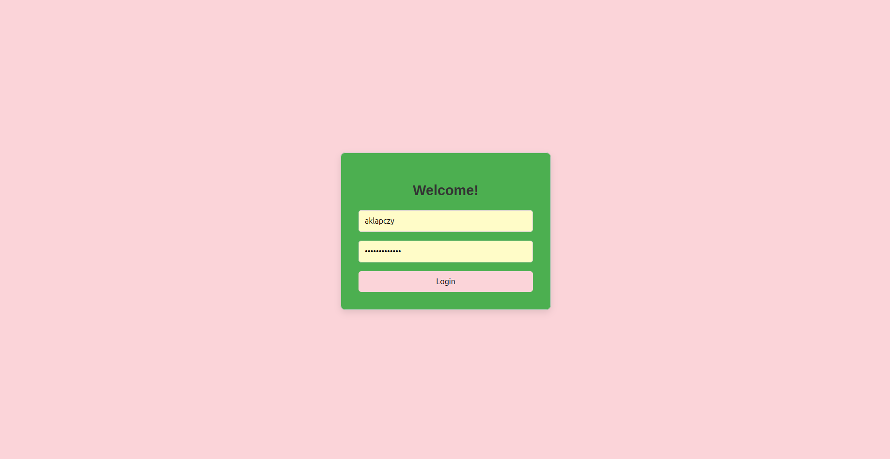
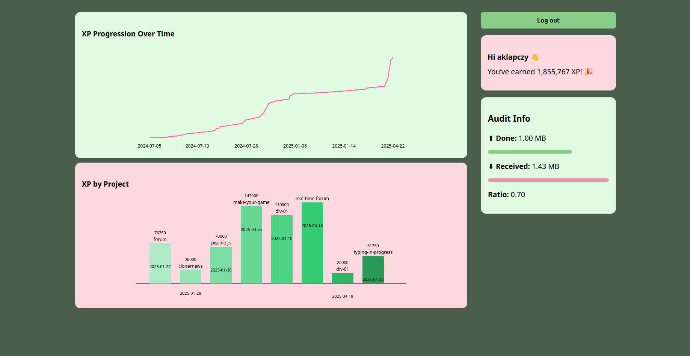

# GraphQL Profile Dashboard

This project is a fully client-side web application that interfaces with the Zone01 GraphQL API to deliver a personalized, real-time profile dashboard. It demonstrates strong command of modern JavaScript practices, GraphQL querying, and data visualization without using any front-end frameworks or libraries.

The dashboard includes a secure authentication flow using JWT, and dynamically renders XP progression and project-level performance via custom SVG graphs. All logic, from GraphQL data handling to DOM rendering, is modularized and structured for clarity and maintainability.

You can check out the site live at [https://kindroky.github.io/graphQL/](https://kindroky.github.io/graphQL/). But you'll need credentials from Zone01 to login. If you don't have any, below are some screenshots of what the site looks like : 





## Features

- Secure login system using JWT authentication
- Fetches real-time data from the Zone01 GraphQL API
- Line graph showing XP progression over time
- Bar chart displaying XP earned per project
- Clean, responsive UI
- Hosted version for easy access and demonstration

## Technologies

- HTML, CSS, JavaScript
- GraphQL (Zone01 API)
- SVG for custom data visualizations
- Hosted on GitHub Pages

## Usage

1. Clone the repository:
   ```bash
   git clone https://github.com/Kindroky/graphQL.git
2. Open index.html in your browser or host the project via a static server.

3. Log in using your Zone01 credentials to access your profile.
